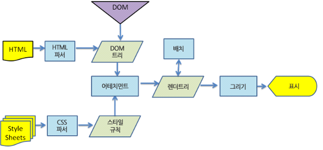
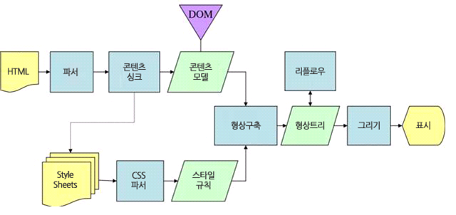
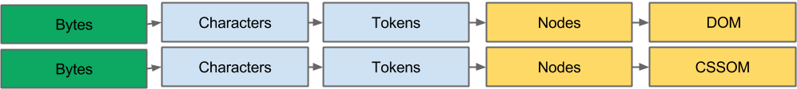

# How Browsers Work
***

### 브라우저의 구조 (Browser Structure)
  
 
* 사용자 인터페이스 (User Interface)  
   주소표시줄, 이전/다음 버튼, 메뉴 등 요청한 페이지를 보여주는 창을 제외한 나머지 모든 부분

* 브라우저 엔진 (Browser Engine)  
  사용자 인터페이스와 렌더링 엔진 사이의 동작을 제어

* 렌더링 엔진 (Rendering Engine)  
  요청 받은 내용을 브라우저 화면에 표시하는 일  
  HTML 파일을 요청하면 HTML과 CSS를 파싱(응답 파일)하여 화면에 표시
  
  > 크롬은 각 탭마다 별도의 랜더링 엔진 인스턴스를 유지  
  즉, 각 탭은 독립된 프로세스로 처리됨  
 
* 통신 (Networking)  
  HTTP request와 같은 네트워크 호출에 사용  
  플랫폼에 독립적인 인터페이스며, 플랫폼 하부에서 실행

* 자바스크립트 해석기 (Javascript Interpreter)  
  자바스크립트 코드를 파싱하고 실행하는 역할

* UI 백엔드 (User Interface Backend)  
  브라우저의 기본 장치(창, 콤보박스 등)를 그릴 때 사용함, OS에 따라 UI가 바뀜

* 자료저장소 (Database Persistence)  
  쿠키와 같은 데이터를 로컬 영역(사용자 하드디스크)에 저장하는 공간

*** 

### 렌더링 엔진 (Rendering Engine)  동작과정  
1. DOM 트리 생성을 위한 HTML, CSS 파싱
2. 렌더 트리 생성
3. 렌더 트리 배치 (reflow / layout)
4. 렌더 트리 그리기

>webkit 렌더링 동작 과정 (크롬, 사파리)

  
>getko 렌더링 동작 과정 (파이어폭스 Mozilla)  

*** 

### DOM 트리 구축
* HTML 마크업은 DOM(Document Object Model)으로 변환되고, CSS 마크업은 CSSOM(CSS Object Model)으로 변환  
* DOM 및 CSSOM은 서로 독립적인 데이터 구조  

  
> 바이트 → 문자 → 토큰 → 노드 → 객체 모델  

1. 변환 : 브라우저가 원시 바이트(html,css)를 읽어와서 개별 문자로 변환
2. 토큰화 : 브라우저가 문자열을 W3C HTML5 표준에 지정된 고유 토큰으로 변환  
   =) `<html>` `<body>` 같은 소스 코드 문자열이 고유 토큰으로 변환됨  
3. 렉싱 : 토큰은 해당 속성 및 규칙을 정의하는 '객체'로 변환
4. DOM (CSSOM) 생성 : 객체는 트리 데이터 구조로 생성됨

> DOM (HMTL) 은 컨텐츠를 나타내며, CSSOM (CSS)는 컨텐츠에 적용되는 스타일 규칙으로 서로 독립적인 객체  
> (DOM + CSSOM = Render Tree)

***

### 렌더 트리 (Render Tree) 생성, 배치, 그리기

  

* 렌더링 트리에는 페이지를 렌더링하는 데 필요한 노드만 포함  
* 렌더 트리 생성 후 렌더 트리 배치 (layout / reflow )  
* 각 노드들의 정확한 위치와 크기 계산(배치) 후 그리기  

***
### 간략 정리
> 1. HTML 마크업을 처리하고 DOM 트리 생성
> 2. CSS 마크업을 처리하고 CSSOM 트리 생성  
> 3. DOM 및 CSSOM을 결합하여 렌더링 트리를 생성  
> 4. 렌더링 트리에서 배치하여(레이아웃을 실행) 각 노드의 기하학적 형태를 계산  
> 5. 개별 노드를 화면에 그리기  

***

* 참고 문서   
  <http://jinbroing.tistory.com/86>  
  <http://wit.nts-corp.com/2014/03/18/1116>  
  <http://bit.ly/1Mih1tv>  

 

