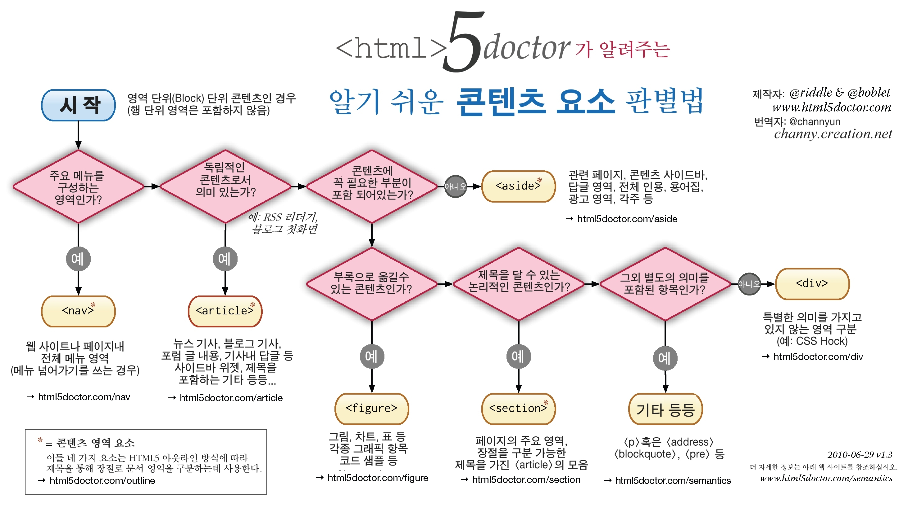

# 시맨틱 웹 (Semantic Web)  
***

### * semantic  **의미의, 의미론적인**  

* 웹 페이지를 만들어주는 HTML 태그에 의미를 부여하여 컴퓨터가 이해할 수 있도록 하여 인간과 컴퓨터 모두 잘 이해할수 있는 웹을 만드는 것  

* 시맨틱 구조의 웹 사이트는 검색엔진 로봇의 데이터 수집이 용이하다.  

  > google, naver 등의 검색사이트는 검색엔진 로봇이 전 세계 사이트들의 html 코드를 읽고 중요 키워드를 저장하는데 이것을 크롤링이라 한다. 

* web 2.0 과 시맨틱 웹과는 다른 말이다.  
  >  현재 인터넷 업계의 신기술이 지향하는 경향을 일컫는 말이 web 2.0

***

## 시맨틱 구조와 HTML5  

웹 페이지 및 웹 애플리케이션의 정보의 의미, 또는 의미를 강화하기 위한 HTML5   

* 비 의미론적 요소의 예 : `
`, ``  
* 의미론적 요소의 예 : `<form>` , `<table>`, ``  

 > 기존 html ( id 또는 class 명으로 구분)
~~~
  
 
    <h1> 제목 </h1> 
  

  

    <ul>
      <li> 메뉴1 </li>
      <li> 메뉴2 </li>
      <li> 메뉴3 </li>
    </ul>
  

  
  
 
    
 내용 

  

  
 
    
 Footer 

  

~~~

 > html5 추가된 시맨틱 태그  
 > 기존 div는 html5 태그로 대체할 수 없는 경우만 사용
 ~~~ 
  <header> 
    <h1> 제목 </h1> 
  </header>
  
  <nav>
    <h2> 메뉴 </h2>
    <ul>
      <li> 메뉴1 </li>
      <li> 메뉴2 </li>
      <li> 메뉴3 </li>
    </ul>
  </nav> 
  
  <section>
    <artice>
      <header> 해당 섹션의 머릿글 입니다. </header>
      
 내용1 

    </artice>
  </section>

  <footer> 
    
 Footer 

  </footer>
~~~  

### html5 추가된 태그  

* `<header>`  
  사이트의 최상단에 사용  
  section, article 의 헤더 부분에 사용 가능
  ~~~
    <header>
      
       로그인 | 회원가입 
    </header>
  ~~~  

* `<nav>`  
  사이트 메뉴 또는 중요도 높은 링크들의 묶음으로 사용  
  ~~~
    <nav>
    <h2> 메뉴 </h2>
    <ul>
      <li> 메뉴1 </li>
      <li> 메뉴2 </li>
      <li> 메뉴3 </li>
    </ul>
  </nav> 
  ~~~  

* `<scetion> `  
  같은 성격의 내용, 즉 관련있는 내용을 section 요소로 묶어 표시  
  탭 방식의 구성일때 각각의 탭을 section 요소로 표시    
  
* `<artice>`  
  독립된 내용에 사용, 주로 뉴스 기사나 블로그의 글을 담는다.

> section 요소가 관련 있는 내용을 묶는 역할이라면 article 요소는 관련 있는 내용 중에서 독립적으로 구성된 글을 별도로 묶는 역할  

> 영역 내에 헤더(header)와 푸터(footer)를 가질 수 있다.

> section이 artice 요소를 포함하지만, 독립적으로 구성된 내용이 몇 개의 섹션으로 나뉘어 있다면 artice이 secion 요소를 포함할 수도 있다. 

> article 요소안에 article 요소가 들어갈 경우, 밖의 내용과 안쪽의 내용이 관련이 있는 내용이라는 것을 의미  

~~~
  <section>
   <header> 흐름이 이어지는 내용 </header>
   <artice> 내용1 </artice>
   <artice> 내용2 </artice>
  </section>

  <artice>
    <header> 독립되는 내용 </header>
    
 뉴스기사 1 

    <artice>
      
 뉴스기사 댓글 

    </artice>
  </artice>
~~~  

* `<aside>`  
  현재 내용과 상관이 없는 내용 ( 배너, 내가 본 상품 등 )  
~~~
  <aside>
  <section>
   <ul>
     <li> 광고1 </li>
     <li> 광고2 </li>
   </ul>
  </section>
  </aside>
~~~  

* `<footer>`  
  저작권, 연락정보 등 본문과의 관련성은 있지만 본문에는 담기 어려운 내용  
  > 일반적으로 문서 내에서 한 번만 사용  
  > section, article 영역에 관한 꼬리말로 사용할 수도 있다  
~~~
  <footer> 
    <address> 연락처 </address> 
    <small> Copyright &copy; 2013 Mozila</small> 
  </footer>  
~~~

***
#### 참고 이미지 (출처는 이미지에 명시되어 있음)  
  

***
* 참고 문서  
<http://webdir.tistory.com/310>  
<http://bit.ly/2tqNAof>  
<http://www.w3im.com/ko/html/html5_semantic_elements.html>  
<http://bit.ly/2vxrou2>  

