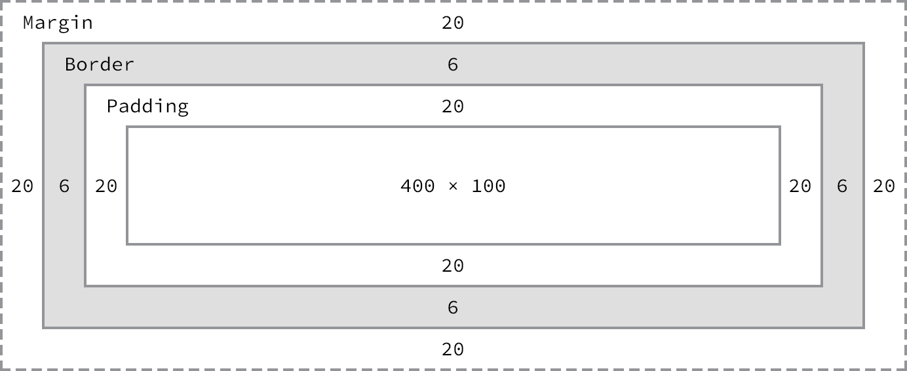

# CSS Box Model
모든 HTML 요소는 Box라고 불리는 사각형의 영역을 생성  
브라우저는 박스 모델의 크기(dimension)와 프로퍼티(색, 배경, 모양 등),  위치를 근거로 하여 렌더링을 실행  

  

* Content : 텍스트나 이미지 등의 내용이 위치하는 영역으로 width, height 를 갖는다  

* Padding : 테두리(Border) 안쪽에 위치하는 요소의 내부 여백 영역  
  padding 값은 패딩 영역의 두께를 의미하며 기본색은 투명(transparent) 
  요소에 적용된 배경의 컬러, 이미지는 패딩 영역까지 적용된다  

* Border : 테두리 영역으로 border 값은 테두리의 두께를 의미  

* Margin : 테두리(Border) 바깥에 위치하는 요소의 외부 여백 영역  
  margin 값은 마진 영역의 두께를 의미하며 투명(transparent)하며 배경색을 지정할 수 없다  
~~~
  
~~~

## width 와 height  
contents 영역을 대상으로 가로와 높이 지정을 위해 사용  
width와 height로 지정한 영역보다 contents가 크면 지정한 영역을 넘치게 된다  
> overflow: hidden;을 지정하면 넘친 콘텐츠를 감출 수 있다  
> px, % 등의 크기 단위를 사용

width와 height는 contetns 사이즈만 지정하게 되므로 box의 전체 사이즈는 아래와 같이 계산한다

* 전체 너비 :  
  width + left padding + right padding + left border + right border + left margin + right margin  
* 전체 높이 :  
  height + top padding + bottom padding + top border + bottom border + top margin + bottom margin  

  
> Width :  492px = 20px + 6px + 20px + 400px + 20px + 6px + 20px  
> Height : 192px = 20px + 6px + 20px + 100px + 20px + 6px + 20px  

> box-size 속성값에 content-box가 기본적으로 적용되어 있기 때문에, box-size 속성값에 border-box를 적용하면 contetns + padding + border가 포함된 box의 width / height 값을 계산할 수 있다

> width와 height 등의 box mdel 속성 (margin, padding, border, box-sizing 등)은 상속되지 않는다  

## margin / padding   
content의 4개 방향(top, right, left, bottom)에 대하여 지정이 가능  
~~~
 * 4개의 값을 지정할 때
  margin: 25px 50px 75px 100px; (top-right-bottom-left)
  margin-top: 25px;
  margin-right: 50px;
  margin-bottom: 75px;
  margin-left: 100px;
  
 * 3개의 값을 지정할 때
  margin: 25px 50px 75px; (top-left,right-bottom)
  margin-top: 25px;
  margin-right: 50px; margin-left: 50px;
  margin-bottom: 75px

 * 2개의 값을 지정할 때
  margin: 25px 50px; (top,bottom - left,right)
  margin-top: 25px; margin-bottom: 25px;
  margin-right: 50px; margin-left: 50px;

 * 1개의 값을 지정할 때
  margin: 25px;
  margin-top: 25px; margin-right: 25px; margin-bottom: 25px; margin-left: 25px;
~~~  
> `margin: 0 auto;` : 중앙에 위치시킬 수 있다  

> `max-width: 300px; ` : 브라우저의 사이즈가 300px보다 작아지면 요소 너비는 브라우저의 너비에 따라서 작아진다  

> `min-width: 300px;` : 브라우저의 너비가 300px보다 작아져도 요소 너비는 지정 너비(300px)을 유지한다  

## border  
* `border-style: dotted;` : border 테두리 선의 스타일 지정  
  > dotted, dashed, solid, double, groove, ridge, inset, outset, none, hidden  
  > 속성값의 갯수에 따라 4개 방향(top, right, left, bottom)에 대하여 지정이 가능
~~~
  /* top | right | bottom | left */
  border-style: none solid dotted dashed;
~~~    

* `border-width: thin` : 테두리의 두께를 지정
  > thin, medium, thick, 15px(수치값)  
  > 속성값의 갯수에 따라 4개 방향(top, right, left, bottom)에 대하여 지정이 가능  

* `border-color` : 테두리의 색상을 지정  
  > border-style과 함께 사용하지 않으면 적용되지 않는다  

* `border-radius` : 테두리 모서리를 둥글게 표현 (px, em, % 사용)  

> border: border-width border-style border-color; (축약형)  

## box-sizeing  
* box-sizing 프로퍼티는 width, height 프로퍼티의 대상 영역을 변경할 수 있다  

* box-sizing 기본값은 content-box이다 (대상 영역이 content 영역)

* box-sizing 프로퍼티의 값을 border-box로 지정하면 마진을 제외한 박스 모델 전체를 width, height 대상 영역으로 지정할 수 있어서 CSS Layout을 직관적으로 사용할 수 있게 한다

> content-box : width, height 값은 content 영역을 의미 (기본값)  
> border-box : width, height 값은 content 영역, padding, border 가 포함된 값을 의미  

  

~~~
 /* box-sizing 프로퍼티는 상속되지 않기 때문에 box-sizing 를 
    css reset로 초기화 시킨다 */ 
 
~~~  

