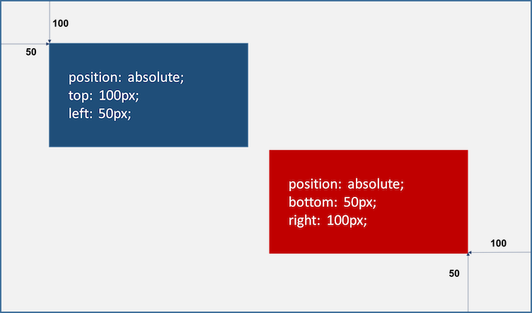

# 요소의 위치를 지정하는 레이아웃의 기본  

## | position
`position` 은 top, bottom, left, right 속성 값을 가지고 요소의 위치를 지정한다.  

  

> right는 오른쪽 면을 기준으로 한다!  

* static (기본위치)  
position 을 지정하지 않을 때의 기본 값으로, 부모의 위치를 기준으로 한다  
이미 설정된 postion을 무력화 (초기화) 할 떄 사용  
좌표 속성 (top , bottom, left, right) 을 사용하지 않는다  

* relative (상대위치)  
static와 동일하지만, 좌표 속성 값을 사용하여 위치를 이동할 수 있다  
( 부모 위치를 기준으로 좌표 값 만큼 이동 )  
  > width와 height 상속되지 않고, 부모의 width 100%, height auto 적용 

* absolut (절대위치)  
부모를 기준으로 하지만 static 으로 지정된 부모를 제외한다.  
즉 relative, absolute, fixed 프로퍼티가 선언되어 있는 부모 또는 조상 요소를 기준으로 위치를 결정 한다  

  > 부모와 조상중 static 상태가 아닌 부모를 찾고 없으면 body가 기준

  > absolute를 주려는 (움직이고 싶은 자식 요소) 요소의 부모에게 relative를 준다.  

  > block 레벨 요소의 width는 inline 처럼 줄어든다 -> width 값 지정 필요  

  * fixed (고정위치)  
  부모와 관계없이 브라우저의 viewport를 기준으로 좌표 값(top, bottom, left, right)을 사용하여 위치를 이동  

  > 스크롤이 되더라도 화면에서 사라지지 않고 항상 같은 곳에 위치  

  > block 레벨 요소의 width는 inline 처럼 줄어든다 -> width 값 지정 필요

  ***
  
  ### NOITC  
  relative는 기본 위치(static으로 지정되었을 때의 위치)를 기준으로 좌표 값을 사용하여 위치를 이동 => 무조건 부모를 기준으로 위치한다. 
  
  absolute는 부모가 static이 아닐 경우에만 부모를 기준으로 위치 => 부모, 조상이 모두 static일 경우, document body를 기준으로 한다.  
  
  > absolute는 부모 요소의 영역을 벗어나 어디든지 위치할 수 있다. 
  
  fixed는 스크롤이 되더라도 화면에서 사라지지 않고 항상 같은 곳에 위치한다.
***

### z-index 속성 : `z-index: 100;`  

(같은 위치에 겹쳐있을 경우) z-index 프로퍼티에 큰 숫자값을 지정할수록 화면 전면에 출력된다.  

### overflow 속성  
자식 요소가 부모 요소의 영역를 벗어났을 때 처리 방법을 정의  

* `overflow: visible; ` : 영역을 벗어난 부분을 표시 (기본값)  
* `overflow: hidden; ` : 영역을 벗어난 부분을 보이지 않게 한다  
* `overflow: scroll; ` : 영역을 벗어난 부분이 없어도 스크롤 표시  
* `overflow: auto; ` : 영역을 벗어난 부분이 있을때만 스크롤 표시  

> 현재 대부분의 브라우저는 `scroll` 값을 주더라도  `auto;` 처럼 작동한다. 

 

  

  

