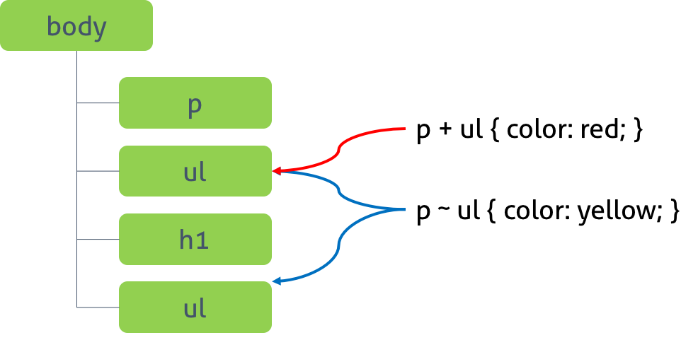

# Style을 적용하기 위해 HTML 요소 선택  
## 셀렉터 지정

1. 전체 셀렉터 :   ` * { color: red; }`  
   HTML 안에 모든 요소에 적용됨 

2. 태그 셀렉터 : `p { color: red; }`  
   HTML 안에 모든 p 태그 요소를 선택  

3. ID 셀렉터 ( # 으로 표시) : `#p1 { color: red; }`  
   태그에 id 속성값을 지정하여 일치되는 요소를 선택
~~~  
  
 
 <body>
    
 선택!! 

    
 선택 안됨 

 </body>
~~~
> id 속성은 html 문서내에서 유일해야 한다.  

4. class 셀렉터 ( . 으로 표시) : `.p1 { color: red; }`  
   태그에 class 속성값을 지정하여 일치되는 요소를 선택  
~~~  
  

  <body>
    
 선택!! 

    
 선택!! 

    
 선택 안됨 

  </body>
~~~  
> class 속성은 html 문서내에서 여러번 사용 가능  

5. 어트리뷰트 셀렉터 : `a[href] ` 
   a 요소 중에 href 속성을 갖는 모든 요소를 선택

6. 셀렉터[어트리뷰트 = ”값”] : `a[target = "_blank"] ` 
   a 요소 중에 target 값이 "_blank"인 모든 요소를 선택  

7. 셀렉터[어트리뷰트 ~= ”값”] : `h1[title ~= "first"]`  
~~~
  

  <body>
    <h1 title="heading first"> 선택!! </h1>
    <h1 title="heading-first"> 선택 안됨 </h1>
  </body>
~~~

8. 셀렉터[어트리뷰트 |= ”값”] : ` p[lang |= "en"]`  
   지정된 속성 값과 일치하거나 "값-" 으로 시작되는 모든 요소
~~~ 
  

  <body>
    
 선택!! 

    
  선택!!  

    
 선택 안됨  

  </body>
~~~

9. 셀렉터[어트리뷰트 ^= ”값”] : `a[href ^= "https://"] `  
   지정된 속성 값으로 시작되는 모든 요소
~~~
  

  <body>
    <a href="https://www.google.com"> 선택!! </a> 
    <a href="test.jsp"> 선택안됨 </a>
  </body>
~~~

10. 셀렉터[어트리뷰트$=”값”] : `a[href$=".html"] `  
    지정된 속성 값으로 끝나는 모든 요소
~~~
  

  <body>
    <a href="test.html"> 선택!! </a> 
    <a href="test.jsp"> 선택안됨 </a>
  </body>
~~~    

11. 셀렉터[어트리뷰트 *= ”값”] : `div[class*="test"]`  
    지정된 속성값을 포함하는 요소
~~~
 

  <body>
    
 *= 'test' 적용됨 

    
 적용대상 없음 

    
 *= 'test' 와 ~= 'test' 적용 

    
 적용대상 없음 (div 요소가 아님) 

  </body>
~~~

***

## 복합 셀렉터  
 

1. 후손 셀렉터 : 셀렉터A 셀렉터B  
   셀렉터 A의 모든 후손 요소중 셀렉터B와 일치하는 요소 선택
~~~ 

<body>
  

    
 포함 

    
      
 포함

    
  

  
 포함 안됨

</body>
~~~

2. 자식 셀렉터 : 셀렉터A > 셀렉터B
~~~
 

 <body>
 

    
 포함 

    
      
 포함 안됨

    
  

  
 포함 안됨

</body>
~~~

3. 형제(동위) 셀렉터 : 셀렉터A + 셀렉터B  
  

~~~

<body>
  <ul>
    <li> 포함 안됨 </li>
  </ul>

  
 셀렉터 P와 동등관계 ul 

  <ul>
    <li> 포함!</li>
  </ul>

  <h2> 셀렉터 P 없음 </h2>
  <ul>
    <li> 포함 안됨  </li>
  </ul>
</body>
~~~

4. 형제(동위) 셀렉터 : 셀렉터A ~ 셀렉터B 
~~~
 

 <body>
  <ul>
    <li> 여기 아님 </li>
  </ul>

  
 셀렉터 P 뒤에 나오는 모든 ul 찾아! 

  <ul>
    <li> 포함!!</li>
  </ul>

  <h2> 바로뒤 아니지만 OK </h2>
  <ul>
    <li> 포함!!  </li>
  </ul>
</body>
~~~  

***

## 가상 클래스 셀렉터 (Pseudo-Class Selector)  

클래스가 존재하지 않지만, 요소의 특정 상태에 따라 클래스를 임의로 지정하여 스타일을 정의해준다.  
가상 클래스는 (.) 마침표 대신에 (:)을 사용하며, CSS 표준에 의해 미리 정의된 이름이 있기 때문에 임의로 정의 할 수 없다.  

### 링크 셀렉터 (Link Pseudo-Class), 동적 셀렉터 (User action Pseudo-Class)  

* `:link` : 셀렉터가 방문하지 않은 링크  
* `:visited` : 셀렉터가 방문한 링크  
* `:hover` : 셀렉터에 마우스가 올라와 있을 떄  
* `:action` : 셀렉터가 클릭된 상태  
* `:focus` :  셀렉터에 포커스가 들어와 있을 떄  
* `:checked` : 셀렉터가 체크된 상태일 때  
* `:enabled` : 셀렉터가 사용가능한 상태일 때  
* `:disabled` : 셀렉터가 사용불가능한 상태일 떄
~~~
    
~~~  

### 구조 가상 클래스 셀렉터(Structural pseudo-classes)  

*  `:first-child` : 셀렉터에 해당하는 모든 요소 중 첫번째 자식 요소 선택  
* `:last-child` : 셀렉터에 해당하는 모든 요소 중 마지막 자식 요소 선택  
* `:nth-child(n)` : 셀렉터에 해당하는 모든 요소 중 앞에서 n번째 자식 요소 선택  
* `nth-last-child(n)` : 셀렉터에 해당하는 모든 요소 중 뒤에서 n번째 자식 요소 선택  
~~~
  
 
  <body>
   
 p요소중 첫번째 자식 : red 선택 
 
   <h1> 지정된 셀렉터 아님 </h1>
   
 p요소지만 선택사항 없음 

   

    
 div요소의 첫번째 p이기 때문에 : red 선택 

    
 여기가 마지막 p 자식 : blue 선택 

   

   <ol>
    <li>Espresso</li>
    <li> nth-child(2) : orange 선택 됨 </li>
    <li>Caffe Latte</li>
    <li>Caffe Mocha</li>
    <li> :nth-last-child(2) : red 선택 됨</li>
    <li>Cappuccino</li>
   </ol>
  </style>
~~~  
> ol > li:nth-child(2n) 짝수번째 요소만 선택  
> ol > li:nth-child(2n+1) 홀수번째 요소만 선택 

### 부정 셀렉터(Negation pseudo-class)  
* `not(셀렉터)` : 셀렉터에 해당하지 않는 모든 요소 선택  
~~~
   

  <body>
   <input type="text" value="Text input"> yellow 선택
   <input type="email" value="email input"> yellow 선택
   <input type="password" value="Password input"> 선택 안됨!!
  </body>
~~~

***

