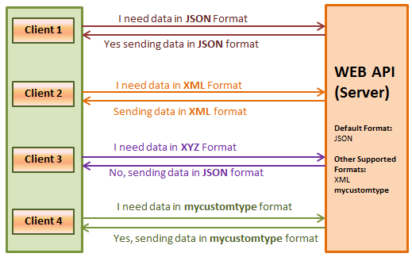

# HTTP
## Request Methods
* HTTP 명세에는 8종류가 등록되어 있고, 각각의 역활과 충족해야 하는 성질이 명시되어 있음 
  > GET, HEAD, POST, PUT, DELETE, CONNECT, OPTIONS, TRACE, PATCH  

* 웹 브라우저는 특정 상황에서 특정 메소드로 요청을 보내도록 만들어져 있음  
  > HTML에서는 GET과 POST만 가능

* Ajax와 같이 요청을 보내는 코드를 직접 짤 때는 요청 메소드를 선택할 수 있음  

* 자료의 본문을 요청하는 GET메소드와, 새로운 자료를 등록하는 POST 메소드가 가장 많이 쓰임  

## (서버가 충족시켜야 하는) 메소드의 성질  
* Safe : 요청이 서버의 상태에 영향을 미치지 않아야 함, 즉 읽기 전용 (GET-> 표준에서 읽기 전용으로 명시)  

* Idempotent : 여러 번 같은 요청을 해도, 한번 요청한 것과 같은 효과여야 함, 네트워크가 불안정해도(끊어져서 여러번 요청이되어도) 안전하게 요청을 보낼 수 있음 (같은 요청을 해도 에러가 나지않아야 한다)
  > Delete, Get  

* Cacheable : (특정 조건을 만족하면) 응답을 클라이언트에(예: 브라우저) 저장해 두었다가 다음번 요청할 때 다시 쓸 수 있음 (보통 읽기전용일 때)  

     

## URL  
    

## Percent Encoding  
* URL은 ASCII문자 (128개의 영문자+특수문자+제어문자) 밖에 사용하지 못하기 때문에, non-ASCII 문자를 위한 표현방법이 필요  
* Percent encoding은 non-ASCII 문자를 위한 웹표준 인코딩 방법으로, Javascript에 관련 기능이 포함되어 있음( 죽 ASCII문자에 들어있지 않은 문자를 표현하기 위한 방법)  
  > encodeURIComponent("한글") => ED%95%9C%EA%B8%80"
  > decodeURIComponent("%ED%95%9C%EA%B8%80") => "한글"  

## Request Target  
* 일반적인 경우 아래와 같은 구조가 사용됨  
  > absolute path + query string + fragment id  
  > GET /path/to/resource?foo=bar&spam=hoge#fragid HTTP/1.1  

### Response Status  
* 응답의 성공, 실패 여부와 종류를 나타내며, 상태코드 + 상태 메세지의 형태로 응답에 포함됨  
  > HTTP/1.1 200 OK  
  > HTTP/1.1 404 Not Found   

참고. [HTTP Status Codes](https://httpstatuses.com/)  

## Status Category (Status Code)   
* 2xx : 성공 
  > 200 OK 성공 
  > 201 Create 자료가 성공적으로 생성됨  

* 3xx : 추가 작업이 필요함  
  > 301 Moved Permanently (Redirection) 자료가 완전히 다른곳으로 이동했음  
  > 302 Found (Redirection)  자료가 일시적으로 다른 곳에 있음  
  > 304 Not Modified (Cache) 클라이언트가 이미 가지고 있던 자료가 수정되지 않았음 (그대로 사용하면 됨)  

* 4xx : 실패 - 클라이언트 책임  
  > 400 Bad Request 요청의 형태가 잘못되어 응답할 수 없음  
  > 403 Forbidden 요청한 자료에 접근할 권한이 없음  
  > 404 Not Found 요청한 자료가 없음  

* 5xx : 실패 - 서버 책임  
  > 500 Internal Server Error  요청을 처리하던 중에 예상치 못한 오류가 발생함  
  > 503 Service Unavailable  서버가 일시적으로 응답할 수 없음  

## Hdaer  
* 요청과 응답에 대한 추가 정보를 표현하는데 사용 됨  
* 인증, 캐싱, 쿠키, 보안, 내용협상, 프록시 등 웹 표준에 정의된 많은 기능을 제어하는데 사용  

- Authorization 요청의 인정 정보  
- User-Agent 요청중인 클라이언트의 정보  
- Location  301, 302 응답에서 자료의 위치 
- Accept 요청이 어떤 형태의 자료를 원하는지 나타냄  
- Content-Type 요청 혹은 응답이 (포함되어 있는 body가) 어떤 형태의 자료인지 나타냄  

## Content Negotiation  
* 요청의 Accept, Accept-Language 등의 헤더를 보고 서버가 그에 맞는 형태의 자료를 응답하는 절차를 content negotiation(내용협상)이라고 함  
  

  

