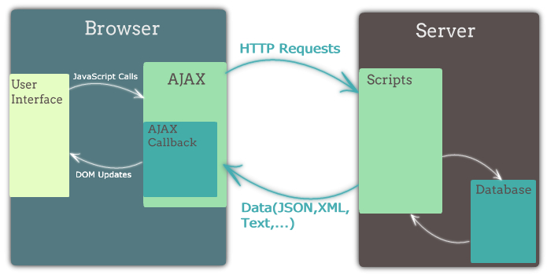

# Ajax  
  비동기적인 웹 어플리케이션의 제작을 위한 
클라이언트 측 웹 개발 기법

...을 뜻하나 요즈음은 의미가 변형되어 
웹 브라우저에서 XMLHttpRequest 혹은 fetch를 이용해서 보내는 HTTP 요청을 통칭하기도 함  

 

* 화면 전체를 다시 로드하지 않고도 내용을 갱신할 수 있어 더 나은 사용자 경험 제공  
* 서버의 응답을 기다리는 동안에도 여전히 웹 어플리케이션을 사용 가능  
* 필요한 자원만 서버에서 받아오게 되므로 트래픽이 줄어듬  
* 클라이언트 구현이 굉장히 복잡해짐 

<http://andrewhfarmer.com/ajax-libraries/>   

## Axios  
Axios는 최근 인기를 끌고 있는 HTTP client입니다. 브라우저에서 사용하면 XMLHttpRequest를 사용하여 Ajax 요청을 보내고, Node.js에서 사용하면 내장 http 모듈을 이용해 요청을 보냅니다. 사용법이 아주 간단하며 Promise 기반으로 깔끔한 코드를 작성할 수 있습니다  

  * Promise based HTTP client  
  * 브라우저와 Node.js에서 모두 사용 가능  
  * XMLHttpRequest, fetch에 비해 사용하기 편하고 기능이 더 많음  
    > fetch API 는 요청을 취소할 수 있는 기능을 제공하지 않는다  
    
## Axios + Json Server Example  
json-server는 내부적으로 express를 사용하고 있어서 커맨드라인을 통해서 json-server를 실행시키지 않고 직접 자바스크립트 파일에서 불러와 사용할 수 있다  보통의 express 객체를 사용하듯이 사용할 수 있어서 필요한 경로에 미들웨어를 마음대로 추가할 수 있다  
 > json-server 매뉴얼과 server.js 파일을 참고  

  * Get 자료읽기 
  * Post 자료생성 
  * Put 치환, 갱신 - 데이터 전체를 update  
  * Patch 요청한 부분만 update  
  * Delete 삭제  
  * Head , Option, Trace, Connect => 잘 사용 안함 (브라우저가 특별한 목적으로 요청) 

  ### GET /api/todos 
  ```
    // GET
    axios.get('/api/todos')
      .then(res => {
        prettyPrint(res.data)
      })
  ``` 

  ### POST /api/todos  
  ```
    // POST
    axios.post('/api/todos', {title: "ajax 공부"})
      .then(res => {
        prettyPrint(res.data)
      })
  ```  

  ### PATCH /api/todos/3 
  ```
  // PATCH
  axios.patch('/api/todos/3', {title: "axios 공부"})
    .then(res => {
      prettyPrint(res.data)
    })
  ```

  ### DELETE /api/todos/3  
  ```
    // DELETE
  axios.delete('/api/todos/3')
    .then(res => {
      prettyPrint(res.data)
    })
  ```  

  ### GET /api/todos/?title=react  
  axios 요청 메소드의 두 번째 인자로 config 객체를 넘길 수 있습니다. config 객체를 통해 요청의 쿼리 스트링, 요청 헤더, 쿠키 포함 여부 등 많은 것들을 설정할 수 있습니다  
  ```
    // config 객체
    axios.get('/api/todos', {
      params: { // query string
        title: 'react 공부'
      },
      headers: { // 요청 헤더
        'X-Api-Key': 'my-api-key'
      },
      timeout: 1000 // 1초 이내에 응답이 오지 않으면 에러로 간주
    }).then(res => {
        prettyPrint(res.data)
      })
  ```  

  ### 응답객체를 통해 여러 정보에 접근이 가능하다  
  ```
    // config.params
    axios.get('/api/todos/1')
      .then(res => {
        console.log(`status code: ${res.status}`)
        console.log('headers:')
        prettyPrint(res.headers)
        console.log('data:')
        prettyPrint(res.data)
      })

      ==> 요청결과  
      status code: 200 
      headers:
        (index):103 {
          "pragma": "no-cache",
          "date": "Tue, 05 Sep 2017 02:30:06 GMT",
          "x-content-type-options": "nosniff",
          "x-powered-by": "Express",
          "vary": "Accept-Encoding",
          "content-type": "application/json; charset=utf-8",
          "status": "200",
          "cache-control": "no-cache",
          "content-length": "42",
          "etag": "W/\"2a-FyrwCVma718tpW54Dgo1v2Yh5yE\"",
          "expires": "-1"
        }
    data:
      (index):103 {
        "id": 1,
        "title": "express 공부"
      }
  ```  

## 쿠키를 통한 인증 예제  

### 로그인  
```
  // 인증을 위한 라우트 핸들러입니다.
  // bodyParser.json() -> json처리 미들웨어 호출 
  server.post('/auth', bodyParser.json(), (req, res) => {
    const {username, password} = req.body
    const matched = users.find(user => user.username === username && user.password === password)
    if (matched) {
      req.session.username = username
      res.send({ok: true, datad: {...}})
    } else {
      res.status(400)
      res.send({ok: flase, error: '400 Bad Request'})
    }
    //res.end() 로 처리하기도한다
    
  // 로그인
  axios.post('/auth', {
    username: 'fast',
    password: 'campus'
  }).then(res => {
    prettyPrint(res.data)
  })
```  

### 로그아웃  
```
  // 로그아웃을 위한 라우트 핸들러입니다.
  server.delete('/auth', (req, res) => {
    req.session = null
    res.end()
  })


  // 로그아웃
  axios.delete('/auth')
    .then(res => {
      prettyPrint(res.data)
    })
```

```
  axios.get('/auth', {
    headers: {
      'Authorization': `Bearer ${token}`
    }
  }).then(res => {
    prettyPrint(res.data)
  })

  axios.post('/count', null, {
    headers: {
      'Authorization': `Bearer ${token}`
    }
  }).then(res => {
    prettyPrint(res.data)
  })
```
* axios.get 는 요청 주소, config 2개 인자가 필요하고, axios.post는 요청 주소, post로 넘길 값 , config 로 3개 인자가 필요하다.
  ( 넘길 데이터가 없으면 null, 세번째 인자는 무조건 config ) 

## Axios Instance  
  중복된 설정을 하지 않도록 해주는 편의도구를 제공 
  한 번 config 객체를 넘겨서 Axios instance를 생성하면 해당 instance를 통해 보내는 요청에는 config 객체가 자동으로 설정 

```
  // Axios.create
  const authedAxios = axios.create({
    headers: {
      'Authorization': `Bearer ${token}`
    }
  })

  authedAxios.get('/auth').then(res => {
    prettyPrint(res.data)
  })
```
***

# Fetch API 

  * 웹 브라우저의 XMLHttpRequest를 대체하기 위해 만들어진 새로운 HTTP client 표준 
  * 비교적 최근에 도입되어 IE 및 구형 안드로이드 브라우저(4.x)는 지원하지 않음 
    * [Fetch Polyfill](https://github.com/github/fetch)
    * [isomorphic-fetch](https://www.npmjs.com/package/isomorphic-fetch) 

## Axios vs Fetch API 
  * Instance와 같이 설정을 재사용하거나 요청중인 연결을 취소하는 등의 편의기능이 Fetch API에는 없음 
  * 현재로서는 Axios를 사용하는 것이 좋은 선택 
  * 다만, Axios는 내부적으로 XMLHttpRequest를 사용하고 있는데 Service Worker 등의 웹 최신 기술이 XMLHttpRequest를 지원하지 않으므로, Service Worker를 사용할 예정에 있는 프로젝트에서는 Axios를 사용할 수 없음 

[참고-정말 좋은 Fetch API](http://hacks.mozilla.or.kr/2015/05/this-api-is-so-fetching/) 

***
### XSS (cross-site scripting) => innerHTML을 사욯하지 말자!!!  
  * 확인되지 않은 DB DATA를 그대로 innerHTML로 넣으면 xss공격당한 데이터 스크립트가 그대로 실행되어 버린다 

  * HTML Escaping : 태그를 HTML Escape Characters 변환한다  

     

### CSRF (cross-site request forgery) 사이트간 요청 위조 

***
# 웹 보완 최종
  1. innerHTML대신 템플릿 언어를 사용한다
  2. https 적용 없이 쿠키사용 (무분별한 쿠키사용, 잘 모르는 상태에서 쿠키사용) 
  3. https 사용하기 


