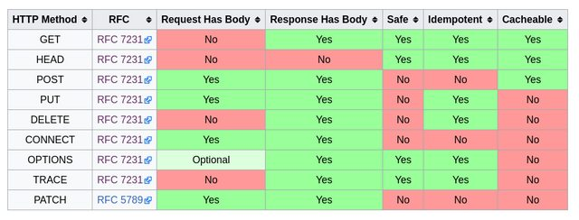

# HTTP Cache 

## Cache 란 
컴퓨터 분야에서의 캐시는 (주로 접근 속도의 개선을 위해) 데이터를 미리 복사해 놓는 임시 저장소, 혹은 그 임시 저장소에 데이터를 저장하는 행위를 가리킴 

'cache' 혹은 'caching'이라는 용어 자체는 특정 기술을 가리키는 것이 아니라, 접근 속도를 개선하기 위해 따로 저장소를 두는 '방법'을 가리킴 

## HTTP Cache 
  * 자원의 효율적 로딩을 위한 웹 표준 
  * 서버에서 가져온 자원(HTML, CSS, JS, 이미지, ...)을 가까운 곳(브라우저, 혹은 다른 서버)에 저장해놓고 재사용 
  * 캐시를 할 것인지 말 것인지, 어떻게 할 것인지를 결정하는 규칙이 복잡하고, 브라우저마다 조금씩 다름 

## HTTP Cache 문제점? 
  캐시된 자원과 실제 자원의 내용이 달라지는 문제를 어떻게 해결할 것인가? 
  즉, 원본과 캐시에 저장된 복사본과의 내용이 달라질 수 있다는 것 

  * Expiration (만료) : 정해진 시간이 지나면 캐시가 자동으로 삭제되도록 설정 
  * Validation (검증) : 서버에 요청을 보내서 캐시를 계속 사용할 수 있는지 확인  
      (cache 할때마다 서버에 검증을 요청) 

## Cache 관련 헤더 
  * Cache-Control  
    (요청, 응답) 캐시와 관련된 다양한 기능을 하는 지시자를 포함. no-cache, max-age가 많이 사용됨. no-cache, max-age=0 지시자는 캐시를 사용하지 않도록 하거나, 캐시를 아직도 쓸 수 있는지 검증하기 위해 사용됨  
    > no-cache : cache 사용안함   
    > max-age : cache 만료기간   
  * ETag  
    (응답) 캐시의 검증을 위해 사용되는 자원의 식별자. 주로 자원의 해시값이 사용되나, 마지막으로 수정된 시각, 혹은 버전 넘버를 사용하기도 함 (원본 식별자)  
    > 원본의 식별자가 달라지면 캐시의 식별자도 달라진다  

  * Expires  
    (응답) 캐시를 만료시킬 시각을 서버에서 명시적으로 지정  

  * Last-Modified  
    (응답) 원본 자료가 마지막으로 수정된 시각  

  * If-None-Match  
    (요청) 검증을 위해 사용됨. 이전에 저장해두었던 자원의 ETag 값을 If-None-Match 헤더의 값으로 요청에 포함시켜서 보내면, 서버는 해당 경로에 있는 자원의 ETag와 비교해보고 자원의 전송 여부를 결정  
    
  * If-Modified-Since  
    (요청) 검증을 위해 사용됨. 이전에 저장해두었던 자원의 Last-Modified 값을 If-Modified-Since 헤더의 값으로 요청에 포함시켜서 보내면, 서버는 해당 경로에 있는 자원의 Last-Modified와 비교해보고 자원의 전송 여부를 결정  

  > 200  (from memory cache) : 검증없이 캐쉬 파일을 읽어옴   
  > 304 not modified : 통신은 이루어지나 header만 통신함  (If-None-Match 와 Etag를 비교하여)  
  > express 는 캐시를 사용하도록 기본 설정이 되어있다  

## Cacheable Methods    
  

  * POST 메소드는 Cacheable 범주에 포함되기는 하지만, 특별한 조건을 만족시켜야 하며 실무에서는 POST chace가 거의 사용되지 않는다  

## cache의 사용   
  * 브라우저는 이미 캐시를 잘 활용하도록 만들어져 있다  
  * Express는 이미 캐시를 잘 활용하도록 만들어져 있다  
    * 일단은 별다른 추가작업 없이도 편하게 캐시 기능을 사용할 수 있지만, 우리가 원하는대로 캐시가 동작하지 않을 때 그 원인을 파악하기 위해 캐시 관련 헤더는 숙지해두는 것이 좋다  
    * HTTP method를 용도에 맞게 사용하는 것도 중요하다  